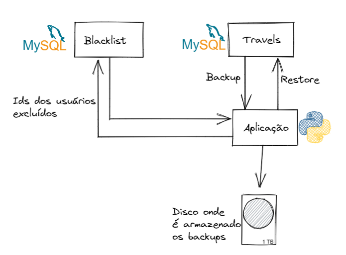

# user_exclude_post_backup



O objetivo dessa aplicação é garantir que usuário que haviam sido excluidos antes de uma rotina de backup e restore do banco não corra o risco de voltar a existir.

A solução faz o uso de 2 bancos de dados MySql:


Travels: Onde se encontra os dados do négocio.

Blacklist: Onde esta localizdo uma tabela de blacklist de ids de usuario.

## Endpoints:

A solução possui alguns endpoints para controle:

### /new_blacklist
Método: POST

Adiciona um usuário a blacklist e remove da tabela de usuarios

Body:

````json
{
	"name": "Priscella",
	"email": "pwathellm@webnode.com"
}
````

Retorno:
Usuário deletado

### /backup
Método: POST

Realiza a rotina de Backup, gera um arquivo .backup no diretorio definido

Sem Body

### /list_backups
Método: GET

Lista os arquivos presentes no diretorio de backups

Retorno:

```json
{
	"backups": [
		{
			"name": "persist_data_2022-05-10.sql",
			"saved_at": "Tue May 10 21:38:46 2022"
		},
		{
			"name": "persist_data_2022-05-19.sql",
			"saved_at": "Thu May 19 20:17:22 2022"
		}
	]
}
```

### /restore
Método: POST

Realiza o restore do backup selecionado

Body:

````json
{
	"backup_file": "persist_data_2022-05-10.sql"
}
````

## Como funciona:
Quando é feito a solicitação de remoção do usuário atravez do *addBlacklist*,
esse registro é removido da tabela de users e o seu ID é salvo na tabela de blacklist
localizada no banco blacklist.

O backup é realizado através do */backup* sendo salvo em um diretório previamente configurado.

Quando o restore é feito através do */restore*, antes de retornar a requisição após o restore do arquivo selecionado o sistema acessa a tabela de blacklist
e reupera todos os ids de usuários já excluido. Com esses IDs ele realiza um DELETE com WHERE IN, dessa forma se algum desses usuários retornar
devido a rotina de bakup, ele é novamente excluido.